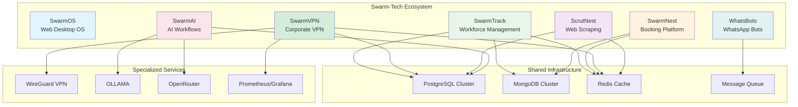

# 🚀 Swarm Tech Product Portfolio

<div align="center">


**Next-Generation Software Solutions for Modern Businesses**

*A Product Portfolio by NorthPeak*

[](LICENSE)
[](README.md)
[](README.md)

[Products](#-products) • [Technology Stack](#-technology-stack) • [Getting Started](#-getting-started) • [Architecture](#-architecture-overview) • [Contributing](#-contributing)

</div>

---

## 📋 Table of Contents

- [Overview](#-overview)
- [Products](#-products)
- [Readiness Status](#-readiness-status)
- [Technology Stack](#-technology-stack)
- [Architecture Overview](#-architecture-overview)
- [Portfolio Statistics](#-portfolio-statistics)
- [Getting Started](#-getting-started)
- [Deployment](#-deployment)
- [Contributing](#-contributing)
- [Support](#-support--contact)
- [License](#-license)

---

## 🌟 Overview

**Swarm Tech** is a comprehensive suite of innovative software solutions designed to empower businesses with cutting-edge technology. Our portfolio spans across web operating systems, workforce management, booking platforms, corporate VPN networks, AI-powered automation, and intelligent communication systems.

Developed by **NorthPeak** (northpeak.app), our mission is to deliver scalable, production-ready applications that solve real-world business challenges using modern technology stacks and best practices.

---

## 🎯 Products

<table>
<tr>
<td width="50%">

### 🌐 SwarmOS
**Web-Based Desktop Operating System**

A revolutionary browser-based desktop environment that provides a familiar OS experience in the cloud.

- **Status:** 🟡 Development (40%)
- **Tech:** Angular 18+, Node.js, MongoDB, Socket.io
- **Location:** `D:\source\AI\SwarmOS`
- **Production Ready:** ❌

[📂 View Project](./SwarmOS/)

</td>
<td width="50%">

### ⏱️ SwarmTrack
**Time Tracking & Workforce Management**

Enterprise-grade time tracking and workforce management solution with real-time monitoring and analytics.

- **Status:** 🟢 Beta (Auth Service Production-Ready)
- **Tech:** NestJS, PostgreSQL, MongoDB, Redis
- **Location:** `D:\source\AI\SwarmTrack`
- **Production Ready:** ⚠️ Partial

[📂 View Project](./SwarmTrack/)

</td>
</tr>
<tr>
<td width="50%">

### 🏨 SwarmNest
**Booking Platform with 360° Virtual Tours**

Advanced booking and reservation system featuring immersive 360° virtual property tours.

- **Status:** 🟢 Production
- **Tech:** React, Node.js, MongoDB, Redis, Socket.io
- **Location:** `D:\source\AI\SwarmNest`
- **Production Ready:** ✅

[📂 View Project](./SwarmNest/)

</td>
<td width="50%">

### 🔐 SwarmVPN
**Corporate VPN Network Platform**

Enterprise-grade self-hosted VPN solution with WireGuard protocol, peer-to-peer features, and advanced network management.

- **Status:** 🟢 Beta (95% - Production Ready)
- **Tech:** Go, React, Tauri, WireGuard, PostgreSQL
- **Location:** `F:\Docker\SwarmVPN`
- **Production Ready:** ⚠️ Beta

[📂 View Project](./SwarmVPN/)

</td>
</tr>
<tr>
<td width="50%">

### 🕷️ ScrutNest
**AI-Powered Web Scraping Platform**

Intelligent web scraping and data extraction platform with visual workflow builder and AI-powered selectors.

- **Status:** 🟡 Foundation Complete (30%)
- **Tech:** React, Node.js, PostgreSQL, Redis, D3.js
- **Location:** `D:\source\AI\ScrutNest`
- **Production Ready:** ❌

[📂 View Project](./ScrutNest/)

</td>
<td width="50%">

### 🤖 SwarmAI
**ChatGPT for n8n Workflows**

AI-powered workflow automation assistant that generates and manages n8n workflows through natural language.

- **Status:** 🟢 Beta (99% - Security Fixes Needed)
- **Tech:** Node.js, PostgreSQL, OLLAMA, OpenRouter
- **Location:** `D:\source\AI\SwarmAI`
- **Production Ready:** ⚠️ Security Fixes Required

[📂 View Project](./SwarmAI/)

</td>
</tr>
<tr>
<td width="50%">

### 💬 WhatsBots
**Multi-Agent WhatsApp Management**

Sophisticated multi-agent WhatsApp bot system for automated customer service and business communication.

- **Status:** 🟢 Production
- **Tech:** React, Node.js, whatsapp-web.js, Bull
- **Location:** `D:\source\AI\WhatsBots`
- **Production Ready:** ✅

[📂 View Project](./WhatsBots/)

</td>
<td width="50%">

</td>
</tr>
</table>

---

## 📊 Readiness Status

| Product | Status | Tech Stack | Production Ready | Documentation | Test Coverage |
|---------|--------|------------|------------------|---------------|---------------|
| 🌐 **SwarmOS** | Development (40%) | Angular + Node.js + MongoDB | ❌ Not Ready | ⭐⭐⭐ | - |
| ⏱️ **SwarmTrack** | Beta | NestJS + PostgreSQL + Redis | ⚠️ Partial | ⭐⭐⭐ | - |
| 🏨 **SwarmNest** | Production | React + Node.js + MongoDB | ✅ Ready | ⭐⭐⭐⭐⭐ | 80%+ |
| 🔐 **SwarmVPN** | Beta (95%) | Go + React + Tauri + WireGuard | ⚠️ Beta | ⭐⭐⭐⭐⭐ | Partial |
| 🕷️ **ScrutNest** | Foundation (30%) | React + Node.js + PostgreSQL | ❌ Not Ready | ⭐⭐⭐⭐ | 10% |
| 🤖 **SwarmAI** | Beta (99%) | Node.js + PostgreSQL + OLLAMA | ⚠️ Security Fixes Needed | ⭐⭐⭐⭐ | 80%+ |
| 💬 **WhatsBots** | Production | React + Node.js + Bull | ✅ Ready | ⭐⭐⭐⭐ | - |

### Legend
- ✅ **Production Ready** - Fully tested, secure, and ready for production deployment
- ⚠️ **Partial/Beta** - Core features production-ready, additional features in development or testing
- ❌ **Not Ready** - In active development, not recommended for production use

---

## 🛠️ Technology Stack

### Frontend Technologies
- **React** - Modern UI library for dynamic web applications (SwarmNest, SwarmVPN, ScrutNest, WhatsBots)
- **Angular 18+** - Enterprise framework for complex applications (SwarmOS)
- **Tauri** - Desktop application framework (SwarmVPN Client)
- **D3.js** - Data visualization and interactive graphics (ScrutNest)
- **Ant Design** - Enterprise UI components (SwarmVPN)
- **TailwindCSS** - Utility-first CSS framework (SwarmVPN)

### Backend Technologies
- **Go 1.23** - High-performance backend for networking applications (SwarmVPN)
- **Node.js** - JavaScript runtime for scalable server-side applications
- **NestJS** - Progressive Node.js framework for enterprise applications (SwarmTrack)
- **Express** - Minimalist web framework for Node.js
- **Gin Framework** - High-performance Go web framework (SwarmVPN)

### Databases
- **PostgreSQL** - Advanced relational database (SwarmTrack, SwarmVPN, ScrutNest, SwarmAI)
- **MongoDB** - NoSQL database for flexible data models (SwarmOS, SwarmTrack, SwarmNest)
- **Redis** - In-memory data structure store for caching and queues (SwarmTrack, SwarmVPN, SwarmNest, ScrutNest)

### Networking & Security
- **WireGuard** - Modern VPN protocol (SwarmVPN)
- **WebSocket** - Real-time bidirectional communication (SwarmOS, SwarmVPN, SwarmNest)
- **NAT Traversal** - Peer-to-peer networking (SwarmVPN)

### AI & Automation
- **OLLAMA** - Local LLM deployment (SwarmAI)
- **OpenRouter** - Multi-model AI routing (SwarmAI)
- **n8n** - Workflow automation platform (SwarmAI)

### Communication & Real-time
- **Socket.io** - Real-time bidirectional communication (SwarmOS, SwarmNest)
- **whatsapp-web.js** - WhatsApp Web API (WhatsBots)
- **Bull** - Premium Queue package for handling distributed jobs (WhatsBots)

### Monitoring & DevOps
- **Prometheus** - Metrics collection and monitoring (SwarmVPN)
- **Grafana** - Analytics and monitoring dashboards (SwarmVPN)
- **Docker** - Containerization platform (All Products)

### Common Technologies Across Products
| Technology | Products Using | Purpose |
|------------|----------------|---------|
| Node.js | 6 Products | Backend Runtime |
| PostgreSQL | 4 Products | Relational Database |
| Redis | 4 Products | Caching & Queue Management |
| React | 4 Products | Frontend Framework |
| MongoDB | 3 Products | Document Database |
| Socket.io/WebSocket | 3 Products | Real-time Communication |

---

## 🏗️ Architecture Overview



### Key Architecture Principles

1. **Microservices Architecture** - Each product operates independently with its own services
2. **Scalable Design** - Built to handle growth from startup to enterprise scale
3. **Cloud-Ready** - Containerized and ready for cloud deployment
4. **API-First** - RESTful and GraphQL APIs for seamless integration
5. **Real-time Capabilities** - WebSocket support for live updates
6. **Data Security** - Encrypted data transmission and secure authentication
7. **Network Security** - Enterprise-grade VPN with WireGuard protocol

---

## 📈 Portfolio Statistics

<div align="center">

| Metric | Value |
|--------|-------|
| **Total Products** | 7 |
| **Production-Ready** | 2 (SwarmNest, WhatsBots) |
| **In Beta** | 3 (SwarmTrack, SwarmVPN, SwarmAI) |
| **In Development** | 2 (SwarmOS, ScrutNest) |
| **Primary Languages** | JavaScript/TypeScript, Go, SQL |
| **Frameworks** | React, Angular, Tauri, NestJS, Gin, Express |
| **Databases** | PostgreSQL, MongoDB, Redis |
| **AI Integration** | 1 (SwarmAI with OLLAMA & OpenRouter) |
| **VPN Technology** | 1 (SwarmVPN with WireGuard) |

</div>

### Technology Distribution

- **Frontend:** React (57%), Angular (14%), Tauri Desktop (14%), Vanilla JS (15%)
- **Backend:** Node.js (86%), Go (14%), NestJS (14%)
- **Database:** PostgreSQL (57%), MongoDB (43%), Redis (57%)
- **Real-time:** Socket.io/WebSocket (43%), Bull Queues (14%)
- **Networking:** WireGuard VPN (14%)

---

## 🚀 Getting Started

### Prerequisites

```bash
# Required
- Node.js v18+ LTS
- npm or yarn
- Git

# Database (based on product)
- PostgreSQL 14+ (for SwarmTrack, SwarmVPN, ScrutNest, SwarmAI)
- MongoDB 6+ (for SwarmOS, SwarmTrack, SwarmNest)
- Redis 7+ (for SwarmTrack, SwarmVPN, SwarmNest, ScrutNest)

# Additional (for specific products)
- Go 1.23+ (for SwarmVPN backend)
- Docker & Docker Compose (recommended for all products)
```

### Quick Start

1. **Clone the Repository**
   ```bash
   git clone https://github.com/your-org/swarm-tech.git
   cd swarm-tech
   ```

2. **Choose Your Product**
   ```bash
   # Navigate to the product directory
   cd SwarmNest  # or any other product
   ```

3. **Install Dependencies**
   ```bash
   npm install
   ```

4. **Configure Environment**
   ```bash
   # Copy environment template
   cp .env.example .env

   # Edit configuration
   nano .env
   ```

5. **Start Development Server**
   ```bash
   npm run dev
   ```

### Product-Specific Setup

Each product has its own detailed setup instructions. Please refer to the individual product README files:

- [SwarmOS Setup Guide](./SwarmOS/README.md)
- [SwarmTrack Setup Guide](./SwarmTrack/README.md)
- [SwarmNest Setup Guide](./SwarmNest/README.md)
- [SwarmVPN Setup Guide](./SwarmVPN/README.md)
- [ScrutNest Setup Guide](./ScrutNest/README.md)
- [SwarmAI Setup Guide](./SwarmAI/README.md)
- [WhatsBots Setup Guide](./WhatsBots/README.md)

---

## 🌐 Deployment

### Production-Ready Products

#### SwarmNest (Booking Platform)
- **Status:** ✅ Production-Ready
- **Deployment:** Docker, Kubernetes, Traditional VPS
- **Requirements:** MongoDB, Redis, Node.js 18+
- **Test Coverage:** 80%+

#### WhatsBots (WhatsApp Management)
- **Status:** ✅ Production-Ready
- **Deployment:** Docker, PM2, Traditional VPS
- **Requirements:** Node.js 18+, Bull Queue
- **Special Note:** Requires WhatsApp Business API setup

### Beta Products

#### SwarmTrack (Workforce Management)
- **Status:** ⚠️ Partial (Auth Service Production-Ready)
- **Deployment:** Docker recommended
- **Requirements:** PostgreSQL, MongoDB, Redis, NestJS

#### SwarmVPN (Corporate VPN)
- **Status:** ⚠️ Beta (95% Complete - Production Ready)
- **Deployment:** Docker Compose, includes client installers
- **Requirements:** PostgreSQL, Redis, Go 1.23+, WireGuard
- **Special Note:** Windows client with MSI/NSIS installers ready

#### SwarmAI (AI Workflow Generator)
- **Status:** ⚠️ Security Fixes Needed (99% Complete)
- **Deployment:** Not recommended until security patches applied
- **Requirements:** PostgreSQL, OLLAMA, OpenRouter API

### Deployment Best Practices

```bash
# General deployment steps
1. Environment Configuration
2. Database Migration
3. Build Optimization
4. Security Hardening
5. Monitoring Setup
6. Backup Strategy
7. Load Balancing
8. SSL/TLS Configuration
```

---

## 🤝 Contributing

We welcome contributions to any of our products! Here's how you can help:

### Contribution Guidelines

1. **Fork the Repository**
   ```bash
   git clone https://github.com/your-username/swarm-tech.git
   ```

2. **Create a Feature Branch**
   ```bash
   git checkout -b feature/your-feature-name
   ```

3. **Make Your Changes**
   - Follow our coding standards
   - Write tests for new features
   - Update documentation

4. **Commit Your Changes**
   ```bash
   git commit -m "feat: add new feature description"
   ```

5. **Push to Your Fork**
   ```bash
   git push origin feature/your-feature-name
   ```

6. **Create a Pull Request**
   - Provide a clear description
   - Reference any related issues
   - Ensure CI/CD passes

### Code Standards

- **JavaScript/TypeScript:** ESLint + Prettier
- **Go:** gofmt + golangci-lint
- **Commit Messages:** Conventional Commits format
- **Testing:** Jest for unit tests, Cypress/Playwright for E2E
- **Documentation:** Update README and inline comments

### Areas We Need Help

| Product | Priority Areas |
|---------|----------------|
| SwarmOS | Frontend components, Testing, Performance optimization |
| SwarmTrack | Microservices completion, API documentation |
| SwarmNest | Test coverage improvement, Feature enhancements |
| SwarmVPN | Linux/macOS client development, Mobile clients |
| ScrutNest | Core scraping engine, UI/UX development |
| SwarmAI | Security fixes, Workflow templates |
| WhatsBots | Message templates, Analytics dashboard |

---

## 📞 Support & Contact

### Company Information

**NorthPeak**
- **🌐 Website:** [northpeak.app](https://northpeak.app)
- **📧 Support:** support@northpeak.app
- **💼 Enterprise Sales:** enterprise@northpeak.app
- **🐛 Bug Reports:** [GitHub Issues](https://github.com/swarm-tech/issues)

### Getting Help

- **📖 Documentation:** [docs.northpeak.app](https://docs.northpeak.app)
- **💬 Community Support:** support@northpeak.app
- **🎓 Developer Resources:** Available at northpeak.app

### Professional Support

For enterprise support, custom development, or consulting services:
- **Website:** [northpeak.app](https://northpeak.app)
- **Sales:** sales@northpeak.app
- **Enterprise:** enterprise@northpeak.app

---

## 📄 License

This project is licensed under the **MIT License** - see the [LICENSE](LICENSE) file for details.

### Individual Product Licenses

All products in the Swarm Tech portfolio are released under the MIT License unless otherwise specified in their individual directories.

```
MIT License

Copyright (c) 2024-2025 NorthPeak (northpeak.app)

Permission is hereby granted, free of charge, to any person obtaining a copy
of this software and associated documentation files (the "Software"), to deal
in the Software without restriction...
```

---

## 🌟 Acknowledgments

Special thanks to all contributors, open-source projects, and the developer community that makes this portfolio possible.

### Built With

- React, Angular, Node.js communities
- Go, Tauri, WireGuard communities
- PostgreSQL, MongoDB, Redis teams
- Socket.io, Bull, whatsapp-web.js maintainers
- OLLAMA and OpenRouter platforms
- Prometheus, Grafana teams

---

<div align="center">

---

**Part of Swarm Tech Portfolio by NorthPeak**

[northpeak.app](https://northpeak.app) | [support@northpeak.app](mailto:support@northpeak.app)

Made with ❤️ by the NorthPeak Team

[⬆ Back to Top](#-swarm-tech-product-portfolio)

</div>
